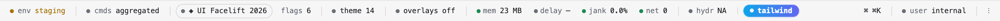

# @nejcm/dev-toolbar

An extensible, low-overhead in-app developer toolbar for React — a bottom bar that
hosts *your* tools.

[](https://www.npmjs.com/package/@nejcm/dev-toolbar)
[](./LICENSE)


<picture>
  <source media="(prefers-color-scheme: dark)" srcset="docs/assets/bar-dark.png">
  
</picture>

*The bar in the playground, hosting the first-party extensions and a few of the
playground's own.*

## What it is

The package is a **shell**: chrome plus hosting. It renders the bar, sorts and
collapses the items you give it, hosts one panel at a time, remembers your
preferences and isolates failures. It ships no metrics, no flag adapters and no
opinions about what a number means — those are **extensions**, and the first-party
ones arrive on their own opt-in subpaths, each with its own bundle.

- **Zero runtime dependencies.** React and `react-dom` are peers; nothing else.
  One extension, [`ext/a11y`](./docs/ext/a11y.md), declares `axe-core` as an
  *optional* peer — install it or don't, and read what installing it costs on
  that page.
- **Light DOM**, so Tailwind, CSS-in-JS and your design system work inside extensions.
- **Restyleable from your own CSS** without `!important`.
- **SSR-safe**: your app server-renders untouched, the bar is client-only.
- **Failure-isolated**: a slot that throws becomes a retry chip, and the rest of the
  bar keeps working.
- **Logical CSS properties throughout**, so `dir="rtl"` mirrors the bar, the `⋮`
  popup and every first-party extension.

## Install

```bash
npm install @nejcm/dev-toolbar
```

React 18 or 19 and `react-dom` 18 or 19 are required peers — the root entry imports
`react-dom` statically, for portals. `@testing-library/react` is an optional peer,
needed only by `@nejcm/dev-toolbar/testing`.

## Use

```tsx
import { DevToolbar } from "@nejcm/dev-toolbar";
import { environment } from "@nejcm/dev-toolbar/ext/environment";
import { metrics } from "@nejcm/dev-toolbar/ext/metrics";

// Built once, at module scope — never inside render.
const extensions = [environment({ context: { environment: "staging" } }), metrics()];

export function Root() {
  return (
    <DevToolbar extensions={extensions}>
      <App />
    </DevToolbar>
  );
}
```

That is the whole setup. It reads like wrapping, but it isn't: `children` render in a
fragment, untouched. The bar portals to `document.body` and is `position: fixed`, so
an app that owns its own `100vh` layout keeps it.

`Cmd+Shift+.` (macOS) or `Ctrl+Shift+.` shows and hides the bar; the binding is
yours to change with the `shortcut` prop.

## What you can put on it

Each extension is a separate opt-in subpath with its own bundle. Import none of
them and you have a bar that hosts only your own tools.

| Extension | What it gives you | Source |
| --- | --- | --- |
| [`ext/metrics`](./docs/ext/metrics.md) | Memory, interaction delay, jank and in-flight network, plus consumer-supplied collectors; each built-in degrades on its own where a browser API is missing | [`src/ext/metrics`](./src/ext/metrics/README.md) |
| [`ext/environment`](./docs/ext/environment.md) | Environment, release, commit and actor context — all supplied by you, all redacted, with production coloured like production | [`src/ext/environment`](./src/ext/environment/README.md) |
| [`ext/flags`](./docs/ext/flags.md) | Your feature flags, with local overrides that survive a reload and a `?dtb-flags=reset` kill switch | [`src/ext/flags`](./src/ext/flags/README.md) |
| [`ext/command-menu`](./docs/ext/command-menu.md) | A `⌘K` palette over every command the toolbar has aggregated. Leave it out and write your own over `useToolbarCommands()` | [`src/ext/command-menu`](./src/ext/command-menu/README.md) |
| [`ext/overlays`](./docs/ext/overlays.md) | Layout boxes, a column grid, an element inspector and focus order — drawn over your page, never intercepting a click | [`src/ext/overlays`](./src/ext/overlays/README.md) |
| [`ext/diagnostics`](./docs/ext/diagnostics.md) | One snapshot for a bug report: the page, long tasks, a tail of console errors and unhandled rejections, and every other extension's diagnostics. You read the exact text before it goes anywhere | [`src/ext/diagnostics`](./src/ext/diagnostics/README.md) |
| [`ext/theme-editor`](./docs/ext/theme-editor.md) | Live design-token editing, with the app's own value next to your edit, and CSS, a recipe, a design-tokens export or a link on the way out | [`src/ext/theme-editor`](./src/ext/theme-editor/README.md) |
| [`ext/a11y`](./docs/ext/a11y.md) | axe-core violations grouped by impact, on demand and never on a timer, with click-to-highlight. The one optional peer: install `axe-core` or the panel says so and nothing breaks. Its 160 KB chunk is fetched at mount by default; `loadOn: "scan"` defers it to the first scan | [`src/ext/a11y`](./src/ext/a11y/README.md) |
| [`ext/agent`](./docs/ext/agent.md) | The bar's state and commands on a global, for an in-page agent to read from `page.evaluate` rather than scrape. Development builds; running commands is a second opt-in | [`src/ext/agent`](./src/ext/agent/README.md) |

The **Source** column is each extension's own README, next to its code: the files
in the directory, what it owns and refuses to own, and the design decisions that
bite. [`src/ext/README.md`](./src/ext/README.md) indexes all nine and states the
conventions they share.

Four more subpaths exist for the code you write yourself:
[`/kit`](./docs/kit.md) — the extension kit: shared types, non-React helpers, one
stylesheet keyed on `data-dtb-kind`, and the thin React controls the first-party panels
are built from, so a third-party extension looks native without copying a few hundred
lines of CSS — [`/runtime`](./docs/runtime.md), the event bus, ring buffers, throttled
store and the redactors (`redact()` anchored, `redactText()` scanning), for
extensions that measure something —
[`/testing`](./docs/testing.md), for testing them, and
`@nejcm/dev-toolbar/styles.css`, the shell's stylesheet for a host that would rather
import it than have it injected at runtime.

## Writing your own extension

An extension is a plain object. No registry, no class, no plugin API:

```tsx
const build: DevToolbarExtension = {
  id: "build-info",
  label: "Build",
  align: "end",
  compact: ({ openPanel }) => (
    <button type="button" data-dtb-part="trigger" onClick={openPanel}>
      {import.meta.env.VITE_COMMIT?.slice(0, 7) ?? "dev"}
    </button>
  ),
  panel: () => <BuildDetails />,
};
```

Add `commands` and it appears in the `⌘K` palette; add `diagnostics()` and it lands
in somebody's bug report; add `start(api)` for background work with an `AbortSignal`
that fires on teardown. Two rules save you an afternoon: **build the object once, at
module scope**, and treat `hidden` as *does not exist here* rather than *unpainted*.
The full contract is in
[docs/extension-contract.md](./docs/extension-contract.md).

## Fitting it into your layout

The bar floats over your page. If you would rather pad your content out of the way:

```tsx
import { DevToolbarInset } from "@nejcm/dev-toolbar";

<DevToolbarInset>
  <App />
</DevToolbarInset>;
```

Or inset by hand — the shell publishes the toolbar's height, bar *plus* any open
panel, on `<html>`. With one toolbar on the page, which is every ordinary app, it
is `--dev-toolbar-height`, whether or not you passed `instanceId`:

```css
.my-layout { padding-bottom: var(--dev-toolbar-height, 0px); }
```

Each instance also publishes its own `--dev-toolbar-height-<instanceId>`. Mount a
second toolbar and the unsuffixed name is withdrawn until only one is left, so two
toolbars never overwrite each other's value — inset by the suffixed names then. The
full rule is in [docs/api.md](./docs/api.md#insetting-your-layout).

> **Changed from earlier releases.** The unsuffixed name used to belong to the
> `"default"` instance alone. Two setups behave differently now: a page that mounts
> the default instance *plus* a named one no longer gets the default's height under
> the unsuffixed name, so `var(--dev-toolbar-height, 0px)` there falls to `0px` —
> switch to `--dev-toolbar-height-default`; and a lone named toolbar now writes the
> unsuffixed name, overriding any `--dev-toolbar-height` your own stylesheet set on
> `<html>`.

## Configuring it

The props most applications touch:

| Prop | Default | Notes |
| --- | --- | --- |
| `extensions` | `[]` | The item list |
| `enabled` | `true` | `false` renders children only — no portal, no lifecycle |
| `shortcut` | `"Mod+Shift+."` | `null` disables it |
| `density` | `"compact"` | `"compact" \| "comfortable"` |
| `colorScheme` | `"system"` | `"light" \| "dark" \| "system"` |
| `instanceId` | `"default"` | Namespaces persisted preferences. Mount-time only |
| `storage` | `localStorage` | Adapter, or `null` to persist nothing. Mount-time only |

Every prop, the `⋮` overflow behaviour, the escape-hatch exports and every
published type are in [docs/api.md](./docs/api.md).

## Styling

Three ways in, and none of them needs `!important` — core's stylesheet lives in
`@layer dev-toolbar`, and unlayered author CSS beats a layered rule whatever the
specificity.

```css
[data-dev-toolbar] {
  --dtb-bg: #120b1f;
  --dtb-fg: #f4e9ff;
  --dtb-accent: #ff7ac6;
}
```

That is the token route. There is also a `data-dtb-part` attribute on every part
(`bar`, `item`, `trigger`, `panel`, …) and a `classNames` prop for putting your own
class on one. Details, and the full part list, in
[docs/styling.md](./docs/styling.md).

## Keeping it out of production

No build magic, no bundler plugin. Two recipes; pick one.

**Runtime flag** — the toolbar renders nothing, but its code is still in the bundle:

```tsx
<DevToolbar enabled={process.env.NODE_ENV !== "production"} extensions={extensions}>
  <App />
</DevToolbar>
```

**Lazy import** — the code is dropped from the production bundle by the dead-code
elimination every bundler already does, because the dynamic `import()` sits behind a
condition that statically folds to `false`:

```tsx
import { lazy, Suspense } from "react";

const Toolbar =
  process.env.NODE_ENV === "production"
    ? null
    : lazy(() => import("./DevTools"));   // ./DevTools imports @nejcm/dev-toolbar

export function Root() {
  return (
    <>
      <App />
      {Toolbar ? (
        <Suspense fallback={null}>
          <Toolbar />
        </Suspense>
      ) : null}
    </>
  );
}
```

**Whichever you pick, the condition is your own deployment switch, not
`NODE_ENV`.** A staging build is a production build — `vite build --mode staging`
sets `NODE_ENV=production` — so `process.env.NODE_ENV !== "production"` drops the
toolbar from the one deployment that most wants it. Fold on the value that names the
deployment, not on the one that says "this is a production build". Under Vite the two
are separate: `import.meta.env.MODE` is the `--mode` you passed, while `PROD` and
`DEV` follow `NODE_ENV`, so `PROD` is `true` for a staging build too. If your mode
names *are* your deployment names, `import.meta.env.MODE !== "production"` is enough;
otherwise define your own variable and expose it with the `VITE_` prefix —
`import.meta.env.VITE_ENV === "production"`, fed from `.env.staging` and friends.
Other bundlers have their own inlining; the rule is the same.

The lazy recipe has one more consequence: **the chunk is not there at boot.**
`lazy()` starts loading when React first tries to render the component, so nothing
in it can run before the app's own first render — seeding your own store from
[`readStoredOverrides()`](./docs/ext/flags.md#it-changes-what-your-app-does), say,
which is exactly the thing that has to happen first. Import that one eagerly from a
module the gate does not cover, or accept a first render with no overrides applied.
Note what the eager import costs: `readStoredOverrides` is exported from
`@nejcm/dev-toolbar/ext/flags`, so importing it puts that entry back into the
production graph — the one thing this section is otherwise keeping out. The
package is side-effect-free apart from CSS (`"sideEffects": ["*.css"]`), so a
tree-shaking bundler should reduce it to that function and its storage helpers
rather than the panel and the `flags()` extension — but it is no longer zero, so
check your bundle rather than assuming either way.

Keeping the toolbar in production is a legitimate choice too — it is what makes an
internal tool useful on staging and for support. If you do, gate it on your own
authorization *before* rendering `<DevToolbar>` at all: core has no identity and no
session, so any check inside it would be theatre.

## Server-side rendering

Safe by construction. `children` server-render untouched, the bar is client-only, so
there is nothing to hydrate and nothing to mismatch. Built entries carry a
`"use client"` banner, so a Next.js app-router page can import them from a server
component — build the extension array in a client module, though, since RSC forbids
a server component from *calling* a function that lives in a client one. The worked
example, and what was verified against Next 16, are in
[docs/ssr.md](./docs/ssr.md).

## Testing your extensions

```tsx
import { makeExtension, renderWithToolbar } from "@nejcm/dev-toolbar/testing";

const { toolbar, unmount } = renderWithToolbar(<App />, {
  extensions: [myExtension],
  layout: { barWidth: 600, itemWidth: 80 },   // jsdom reports every box as 0×0
});

toolbar.openPanel("my-extension");
expect(toolbar.panel("my-extension")).not.toBeNull();

toolbar.resize(160);
expect(toolbar.overflowedIds()).toContain("my-extension");
unmount();
```

`@nejcm/dev-toolbar/testing` also ships `makeExtension()` and `makeCommand()` for
throwaway extensions and commands, `fakeExtensionApi()` for the `ExtensionRuntimeApi`
that `start()` receives, `createMockBus()` for a bus with a hand-cranked clock, and
`installToolbarLayout()` for driving the fake layout yourself. Storage
defaults to a fresh in-memory adapter, so tests never leak preferences into each
other. The whole surface, and the Jest caveats, are in
[docs/testing.md](./docs/testing.md).

## Documentation

| Document | What is in it |
| --- | --- |
| [docs/api.md](./docs/api.md) | Every prop, export and type on the root entry |
| [docs/extension-contract.md](./docs/extension-contract.md) | The object you write, the slot props, and `start(api)` |
| [docs/kit.md](./docs/kit.md) | `/kit`: shared types, helpers, the `data-dtb-kind` stylesheet and the React controls |
| [docs/embedding.md](./docs/embedding.md) | A third-party devtool on the bar: the four-line recipe, the CSS rule, `embed()`, and one chip for a whole devtools shell |
| [docs/runtime.md](./docs/runtime.md) | `/runtime`: event bus, ring buffers, throttled store, `redact()` and `redactText()` |
| [docs/testing.md](./docs/testing.md) | `/testing`: helpers, the fake layout, the mock bus |
| [docs/styling.md](./docs/styling.md) | Tokens, parts, `classNames` |
| [docs/ssr.md](./docs/ssr.md) | Hydration and the Next.js app router |
| [docs/ext/](./docs/ext/) | One document per first-party extension, including [`ext/agent`](./docs/ext/agent.md) |
| [src/ext/](./src/ext/README.md) | The developer's view of the same nine: files, ownership, and the decisions that bite |
| [docs/architecture.md](./docs/architecture.md) | What the shell guarantees, and why the boundaries sit where they do |
| [docs/adr/](./docs/adr/) | Decision records |
| [CHANGELOG.md](./CHANGELOG.md) | Every release |

> **Status:** complete and **on npm** — every `feat:`/`fix:` that lands on `main`
> ships from CI ([CONTRIBUTING](./CONTRIBUTING.md#releasing)), so
> `npm install @nejcm/dev-toolbar` resolves to the latest release. The shell,
> `/runtime` and all nine first-party extensions are implemented and published.
> `CONTRACT_VERSION` is **2**:
> commands may declare an `input` schema and resolve a result, which asks nothing
> of an extension written against v1 — see
> [contract v2](./docs/extension-contract.md#contract-v2--commands-with-input-and-a-result).
> The places the contract has moved are in the [changelog](./CHANGELOG.md).

---

# Contributing

Issues and pull requests are welcome. [CONTRIBUTING.md](./CONTRIBUTING.md) is the
long version — setup, the commit convention, the release process; this is enough to
get a change built and checked.

## Getting set up

Requires [bun](https://bun.sh) and Node 24 or newer (`.nvmrc` pins the major).

```bash
bun install
```

`bun install` also installs the `pre-commit` and `commit-msg` git hooks.

## The one command that matters

```bash
bun run verify
```

That is `format:check && typecheck && lint && knip && build && test &&
check:package`, in sequence. If it passes locally it passes in CI — though CI
does not run it verbatim: it runs `verify:static` (everything but the suite) and
then `test:coverage`, rather than the suite twice. The pieces, for a faster loop:

| Command | What it does |
| --- | --- |
| `bun run typecheck` | `tsc --noEmit` |
| `bun run lint` / `lint:fix` | `oxlint --max-warnings=0` — a ratchet; a new warning fails the build |
| `bun run format` / `format:check` | `oxfmt` over JS, TS and YAML |
| `bun run test` / `test:watch` | `vitest` |
| `bun run test:coverage` | `vitest run --coverage`, against the floors in `vitest.config.ts` |
| `bun run build` | `tsup` |
| `bun run knip` | Unused files, exports and dependencies — a gate, not a report |
| `bun run check:package` | `publint` + `attw` over a packed tarball |
| `bun run size` | A per-entrypoint size table |

## Trying a change for real

```bash
bun run playground:install   # once
bun run playground           # builds the package, then Vite on :5273
```

`examples/playground` is a Vite app that consumes the built `dist/` through
`file:../..` exactly as a published consumer does. It exists for the checks unit
tests cannot make: overflow collapsing live, overlays over a real `100vh` layout,
restyling, Tailwind, and a design-token set the page actually consumes. It rebuilds
`dist/` on start, so after editing `src/` run `bun run build` (or `bun run dev` in a
second terminal) and reload.

Every chip on the bar has a control on the page that moves it, and the ones only
real content can move have real content: a sized banner that is the page's `LCP`
element, a gallery that fetches its manifest and can render the images with or
without a reserved box — the difference between `CLS` at `0.000` and `CLS` past
`0.1` — a cross-origin YouTube `<iframe>` loaded on request, for the bar to keep
drawing over and lose its keyboard shortcuts inside, and an animation loop whose
*heavy* mode is the only thing in the app that makes `jank` go red and stay red.
The article at the bottom is what each chip means.

```bash
bun run test:jest-consumer   # builds, then runs Jest against dist/
bun run test:vite-consumer   # builds, packs, then drives a Vite consumer of the tarball in Chromium
```

`test/fixtures/jest-consumer` is a real Jest 30 + CommonJS consumer of the built
package. It is a separate script on purpose — it needs a fresh `dist/`. Before
deleting it as redundant, read
[its README](./test/fixtures/jest-consumer/README.md): this failure class has
already shipped twice.

`test/fixtures/vite-consumer` is the ESM half: the packed tarball, unpacked into
a consumer's `node_modules`, served by a cold Vite dev server with the default
dependency optimizer — the path the playground opts out of. It asserts one
React across core, `/kit` and `ext/*`;
[its README](./test/fixtures/vite-consumer/README.md) records the two-React
report that motivated it.

## House rules

- **Bun, not npm, for installing anything** — both `test/fixtures/*` consumers
  included. npm is the publish client, not a package manager choice.
- **Zero runtime dependencies is a rule.** A new `dependency` needs an answer to
  "why can't the consumer pass this in?".
- **Core never imports `runtime/` or `ext/`**, and extensions import only *types*
  from core. `src/core/__tests__/boundary.test.ts` is the gate.
- **Tests are colocated** in `__tests__/`. New behaviour needs a test; a bug fix
  needs one that fails before the fix.
- **Conventional Commits, enforced** by a hook — and the repo is squash-only, so the
  **PR title** is the message that lands on `main` and the one release-please reads.
- **`src/styles.css` and `src/core/css.ts` are byte-identical copies.** Edit the CSS
  file, then paste it into the template literal; a test enforces it.
- **Changing the extension contract is a published-API change.** Say so in the PR
  description, and read
  [ADR-003](./docs/adr/ADR-003-contract-version-policy.md) before touching
  `CONTRACT_VERSION`.

The full repo map — which folder is which layer and what may import what — is in
[AGENTS.md](./AGENTS.md), the reasoning behind the boundaries is in
[docs/architecture.md](./docs/architecture.md), and
[src/core/contract.ts](./src/core/contract.ts) is the source of truth for every type
in the contract.

## License

MIT — see [LICENSE](./LICENSE).
