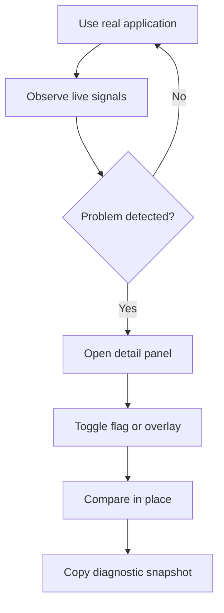
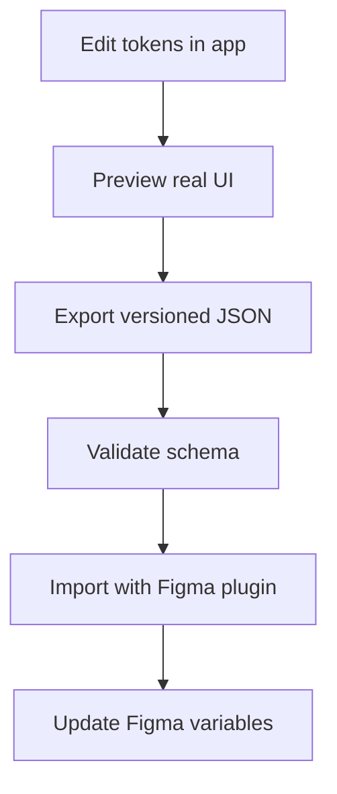

# Linear-inspired internal developer toolbar

It combines what is visible in the supplied screenshot, what Linear has publicly confirmed, and implementation recommendations where Linear’s exact internals are unknown.
The toolbar should be treated as an extensible internal developer platform—not merely a row of counters.

## 1. Product objective

Build an always-available, low-overhead toolbar inside the real application that lets authorized employees:

* See important runtime-health signals continuously.
* Toggle feature flags without leaving the current screen.
* Compare old and new implementations instantly.
* Inspect the environment, authenticated actor and application context.
* Activate visual debugging overlays.
* Open specialized project tools such as a theme-token editor.
* Capture a diagnostic snapshot for bug reports.
* Make migrations visible and measurable across normal application usage.

The fundamental feedback loop is:



## 2. What is visible in the screenshot

The screenshot shows a toolbar attached to the bottom of Linear’s desktop application.

### Left-hand controls

| Visible item            | Likely responsibility                                       | Confidence |
| ----------------------- | ----------------------------------------------------------- | ---------: |
| Purple status indicator | Current application/build status                            |     Medium |
| `Prod`                  | Backend or deployment environment                           |       High |
| `user`                  | Current actor/account mode                                  |     Medium |
| `internal`              | Employee/internal-access status or workspace type           |     Medium |
| Arrow-in-box and `none` | Impersonation, override, branch or special session selector |        Low |
| Sparkle icon            | Experiments or internal tools                               |     Medium |
| Bug icon                | Debugging/diagnostics                                       |       High |
| Moon icon               | Theme or appearance control                                 |       High |
| Flag icon               | Feature-flag browser                                        |       High |
| `UI Facelift 2026`      | Promoted feature flag/experiment                            |       High |

### Right-hand metrics

| Visible item   | Recommended interpretation             |
| -------------- | -------------------------------------- |
| `⌘`            | Keyboard shortcut/help or command menu |
| `Mem 0.82GB`   | JavaScript heap usage                  |
| `Delay 418ms`  | Recent interaction/input delay         |
| Icon + `5,629` | DOM-node or rendered-component count   |
| `Jank 17%`     | Percentage of dropped/late frames      |
| `Net 0`        | Active network requests                |
| `Hydr NA`      | Hydration duration/status              |
| Down arrow     | Open expanded diagnostic drawer        |
| Minus          | Collapse toolbar                       |

The StyleX article shows a newer or differently configured version with a styled-components counter inserted among these metrics. This suggests metrics are registered dynamically rather than permanently hard-coded.

## 3. Recommended feature set

Exactly one of the sections below is the shell. The rest are extensions, and each ships
as its own subpath export of the same package:

| Section | Ships as |
| --- | --- |
| 3A Toolbar shell | `@nejcm/dev-toolbar` |
| 3B Environment and session context | `@nejcm/dev-toolbar/ext/environment` |
| 3C Feature-flag controls | `@nejcm/dev-toolbar/ext/flags` |
| 3D Runtime performance HUD | `@nejcm/dev-toolbar/ext/metrics` |
| 3E Long-task and responsiveness diagnostics | `@nejcm/dev-toolbar/ext/metrics` |
| 3F Migration counters | `@nejcm/dev-toolbar/ext/metrics` |
| 3G Visual inspector and overlays | `@nejcm/dev-toolbar/ext/overlays` |
| 3H Theme and design-token editor | `@nejcm/dev-toolbar/ext/theme-editor` |
| 3I Debugging controls | `@nejcm/dev-toolbar/ext/diagnostics` |
| 3J Diagnostic snapshot | `@nejcm/dev-toolbar/ext/diagnostics` |
| 5 Runtime data architecture | `@nejcm/dev-toolbar/runtime` (opt-in) |
| 6 Access and security model | the consumer's own concern; guidance only |

### A. Toolbar shell

The shell is the whole of `@nejcm/dev-toolbar`'s root entry, and it contains no
features. It is chrome plus hosting.

The shell is responsible for:

* Fixed bottom (or top) placement, in a portal.
* Compact and expanded modes.
* Rendering the extensions it is given, in `align` / `order` / `priority` order.
* Collapsing low-priority items into an overflow menu.
* Hosting one panel at a time.
* Style tokens and the restyling surface (`--dtb-*`, `data-dtb-part`, `classNames`).
* Focus management and keyboard navigation.
* Persisted preferences, through an injectable storage adapter.
* An error boundary around every extension.
* Aggregating extension-declared commands — without rendering a palette.

The shell is explicitly **not** responsible for metric semantics, severity thresholds,
data collection, flag adapters, access control, or any of sections 3B–3J.

Recommended behavior:

* Height: 28–32 px.
* Expanded panel: 320–480 px, resizable, persisted.
* Do not cover application content: render `children` untouched and expose
  `--dev-toolbar-height` for apps that want to inset themselves.
* Render in a portal on `document.body`, in the **light DOM**, with all shell CSS inside
  an `@layer` scoped by `[data-dev-toolbar]`. Not a Shadow DOM boundary: extensions are
  user code, and inside a shadow root their utility classes, CSS-in-JS and their own
  portals stop working. Isolation that only the shell's own styles enjoy is not worth
  taxing every extension author.
* Allow repositioning to top or bottom.
* A toggle shortcut, `Ctrl/Cmd + Shift + .` by default and overridable.
* Save visibility, position, active panel, panel height and per-extension enablement.
* Report page and bar visibility to extensions; let each one decide what to pause.

### B. Environment and session context

Display:

* Environment: local, preview, staging or production.
* Release version and Git SHA.
* Branch or preview deployment ID.
* Region.
* API endpoint.
* Build timestamp.
* Current user ID.
* Workspace/tenant ID.
* Employee/internal-user status.
* Impersonation status.
* Permissions or role.
* Sync connection status.

Clicking the context area should open a panel with copyable values:

```text
Environment: production
Release: web-2026.08.28.4
Commit: a84c7e1
Region: ap-southeast-1
User: usr_123
Workspace: ws_456
Route: /acme/project/ABC
Flags: ui-facelift=true, new-header=false
```

Security rules:

* Never expose access tokens or complete session cookies.
* Mask email addresses and personally identifiable values in copied snapshots by default.
* Make impersonation visually unmistakable.
* Audit impersonation and production-level flag mutations.

### C. Feature-flag controls

This is one of the most valuable parts of Linear’s implementation.

Include:

* Searchable list of all available flags.
* Current evaluated value.
* Default value.
* Local override value.
* Evaluation source: default, rule, cohort, workspace or local override.
* Flag owner.
* Description.
* Expiration date.
* Related project/issue URL.
* “Recently used” and “promoted” flags.
* One-click Boolean toggles.
* Typed editors for string, numeric and variant flags.
* Clear individual/all overrides.
* Copy a shareable override recipe.
* Optional side-by-side or rapid-toggle comparison mode.

Use two mutation levels:

1. **Local session override:** safe, immediate and stored locally.
2. **Remote flag change:** privileged, confirmed, audited and performed through the backend.

For visual comparisons, local overrides should update without a full reload whenever the application architecture supports it. If a flag cannot be changed safely at runtime, label it “reload required.”

Example model:

```ts
type FlagValue = boolean | string | number | null;

interface FeatureFlagDefinition {
  key: string;
  label: string;
  description?: string;
  owner?: string;
  type: "boolean" | "string" | "number" | "variant";
  defaultValue: FlagValue;
  reloadBehavior: "live" | "route-refresh" | "full-reload";
  expiresAt?: string;
  projectUrl?: string;
}

interface EvaluatedFlag {
  definition: FeatureFlagDefinition;
  value: FlagValue;
  source: "default" | "server-rule" | "cohort" | "local-override";
  override?: FlagValue;
}
```

Override precedence:

```text
local toolbar override
        ↓
URL/shared recipe override
        ↓
server-side user/workspace evaluation
        ↓
flag default
```

Local overrides should be namespaced by environment, user and workspace so a staging override cannot accidentally affect production testing.

### D. Runtime performance HUD

Every metric needs:

* Current value.
* Unit.
* Rolling window.
* Severity threshold.
* Short explanation.
* Small historical sparkline.
* Click-through details.
* Reset button.
* “Copy diagnostic data.”

#### Memory

On Chromium/Electron:

```ts
const memory = (
  performance as Performance & {
    memory?: {
      usedJSHeapSize: number;
      totalJSHeapSize: number;
      jsHeapSizeLimit: number;
    };
  }
).memory;
```

Display:

* Used JS heap.
* Total allocated heap.
* Heap limit.
* Change over the last minute.
* Warnings for sustained growth.

Limitations:

* `performance.memory` is Chromium-specific and non-standard.
* In unsupported browsers, show `NA`.
* Do not present it as total process memory.

Recommended status thresholds should be relative:

* Green: under 50% of heap limit.
* Yellow: 50–75%.
* Red: above 75% or sustained monotonic growth.

Use a rolling series rather than alarming on a single garbage-collection cycle.

#### Delay

Implement an INP-like interaction monitor using `PerformanceObserver` and Event Timing:

```ts
const observer = new PerformanceObserver(list => {
  for (const entry of list.getEntries()) {
    if (entry.entryType !== "event") continue;

    const event = entry as PerformanceEventTiming;
    const duration = event.duration;
    const inputDelay = event.processingStart - event.startTime;
    const processing = event.processingEnd - event.processingStart;

    interactionStore.record({
      name: event.name,
      duration,
      inputDelay,
      processing,
      startTime: event.startTime,
    });
  }
});

observer.observe({
  type: "event",
  buffered: true,
  durationThreshold: 16,
});
```

Show:

* Last significant interaction.
* Worst interaction over a rolling 30-second window.
* Input delay.
* Handler processing time.
* Presentation delay when measurable.
* Target element description.

Recommended coloring:

* Green: ≤200 ms.
* Yellow: 200–500 ms.
* Red: >500 ms.

Those boundaries align with INP guidance, but the toolbar should make clear whether it shows the latest event, maximum, or rolling percentile.

#### Jank

Use `requestAnimationFrame` to detect late frames during active interaction or animation windows.

```ts
const FRAME_MS = 1000 / 60;

function frameLoop(now: number) {
  if (previousFrame) {
    const delta = now - previousFrame;
    const expectedFrames = Math.max(1, Math.round(delta / FRAME_MS));
    const droppedFrames = Math.max(0, expectedFrames - 1);

    frameStore.record({
      delta,
      expectedFrames,
      droppedFrames,
    });
  }

  previousFrame = now;
  requestAnimationFrame(frameLoop);
}
```

Recommended calculation:

```text
jank percentage =
  dropped frames / expected frames × 100
```

Calculate it over a rolling five-second active window. Avoid counting long periods where:

* The tab is backgrounded.
* The window is minimized.
* The computer wakes from sleep.
* Browser throttling is active.
* No meaningful interaction or animation is occurring.

The detail view should correlate jank with:

* Long tasks.
* React commits.
* Layout shifts.
* Network completions.
* Garbage-collection indicators, where accessible.

Suggested thresholds:

* Green: <2%.
* Yellow: 2–5%.
* Red: >5%.

These should be configurable based on real application baselines.

#### Network

Instrument the application’s HTTP client instead of globally monkey-patching `fetch` where possible.

Track:

* Active requests.
* Request duration.
* Response status.
* Transferred bytes when available.
* Cache hits.
* Retries.
* Aborts.
* WebSocket/sync state.
* Slow requests.
* Failed requests.

Example instrumentation:

```ts
interface NetworkEvent {
  id: string;
  method: string;
  url: string;
  category?: "api" | "sync" | "asset" | "analytics";
  startedAt: number;
  completedAt?: number;
  status?: number;
  bytes?: number;
  cached?: boolean;
  error?: string;
}
```

The compact `Net` metric can mean active request count. Its drawer should show recent request history.

Redact:

* Authorization headers.
* Cookies.
* Query parameters containing tokens.
* Request and response bodies unless explicitly allowed.
* Sensitive GraphQL variables.

#### Hydration

Instrument hydration explicitly rather than trying to infer it entirely from resource timing:

```ts
performance.mark("app-hydration-start");

hydrateRoot(container, <App />, {
  onRecoverableError(error, info) {
    hydrationStore.recordError(error, info);
  },
});

// Signal this from a component effect at the hydrated app boundary.
performance.mark("app-hydration-end");
performance.measure(
  "app-hydration",
  "app-hydration-start",
  "app-hydration-end",
);
```

Display:

* `NA` for a fully client-rendered view.
* `Pending` while hydration is underway.
* Duration when complete.
* Recoverable hydration error count.
* Hydrated root count.
* Optional delayed-boundary/Suspense information.

If the application uses streaming SSR, track each significant boundary separately rather than claiming one global hydration duration is complete too early.

#### DOM/render count

The screenshot’s `5,629` is not publicly defined. A DOM-node count is the most useful approximation:

```ts
document.getElementsByTagName("*").length;
```

Improve it by showing:

* Total element count.
* Maximum DOM depth.
* Largest child list.
* Elements added/removed during the last navigation.
* Detached-node estimates where possible.

Do not run a complete DOM traversal every frame. Recount:

* After route completion.
* On demand.
* At a slow interval such as every 5–10 seconds.
* After a debounced `MutationObserver` signal.

A React-specific module could separately track commits and render counts, but it should not depend on private React internals in the initial implementation.

### E. Long-task and responsiveness diagnostics

Add a module based on the Long Tasks API:

```ts
new PerformanceObserver(list => {
  for (const entry of list.getEntries()) {
    longTaskStore.record({
      startTime: entry.startTime,
      duration: entry.duration,
    });
  }
}).observe({ type: "longtask", buffered: true });
```

Show:

* Number of long tasks in the current window.
* Total blocked time.
* Worst task.
* Timestamp.
* Nearby route, interaction and network events.

This module can power the `Delay` and `Jank` investigation drawer even if it is not permanently shown in the compact bar.

### F. Migration counters

This reproduces Linear’s documented StyleX workflow.

The module system should allow teams to register temporary counters such as:

* Styled-components rules remaining.
* Deprecated component instances.
* Legacy API usage.
* Untyped GraphQL requests.
* Old icon system usage.
* Components missing design tokens.
* Pages using an obsolete state library.
* Accessibility violations.

For styled-components specifically:

* Count rules or generated style tags associated with `data-styled`.
* Recalculate after route changes and debounced DOM mutations.
* Provide an overlay that marks legacy and migrated regions.
* Let the user click an element to inspect its relevant component or DOM metadata.

For reliable component-level overlays, explicitly emit development metadata:

```tsx
<Card
  data-dev-component="ProjectCard"
  data-style-engine="stylex"
  data-source="features/projects/ProjectCard.tsx"
/>
```

Avoid attempting to reverse-engineer minified production component names.

### G. Visual inspector and overlays

Recommended overlay modes:

* Component boundaries.
* Style engine: legacy versus new.
* Design-token violations.
* Layout boxes.
* Scroll containers.
* Z-index stacking contexts.
* Focus order.
* Accessible names.
* Rerender flash.
* Slow React commits.
* Feature ownership.
* Experiment variant.
* Offline/sync state.

Overlay architecture:

* Render highlights in a separate top-level layer.
* Use `getBoundingClientRect()` only for visible candidate elements.
* Recalculate on scroll and resize via `requestAnimationFrame`.
* Use `ResizeObserver` selectively.
* Disable overlays automatically before screenshots unless requested.
* Avoid attaching observers to every element.

### H. Theme and design-token editor

Based directly on Linear’s published description, include:

* Base UI color.
* Accent color.
* Contrast.
* Light/dark mode.
* Hue, chroma and lightness controls.
* Individual token overrides.
* Surface/subtree selection.
* Reset token/reset all.
* Before/after comparison.
* Presets and named recipes.
* Import/export JSON.
* Copy CSS variables.
* Share recipe link.
* Figma-compatible export.

Suggested recipe:

```ts
interface ThemeRecipe {
  schemaVersion: 1;
  name: string;
  mode: "light" | "dark";
  inputs: {
    base: string;
    accent: string;
    contrast: number;
  };
  overrides: Record<
    string,
    {
      l?: number;
      c?: number;
      h?: number;
      alpha?: number;
    }
  >;
  createdBy?: string;
  createdAt: string;
}
```

Apply previews through CSS custom properties scoped to the application root or a selected subtree. This provides immediate feedback without regenerating stylesheets.

The Figma pipeline should be deterministic:



### I. Debugging controls

Useful compact controls include:

* Enable verbose logging.
* Open internal log viewer.
* Clear caches.
* Reset local database.
* Restart sync.
* Simulate offline/slow network.
* Simulate API failures.
* Pause WebSocket updates.
* Force loading/empty/error states.
* Show state-store inspector.
* Copy current route/entity IDs.
* Capture diagnostic snapshot.

Potentially destructive actions—such as clearing the local database—must require confirmation and explain recovery behavior.

### J. Diagnostic snapshot

Provide a one-click “Copy debug report” action containing:

```ts
interface DiagnosticSnapshot {
  generatedAt: string;
  app: {
    version: string;
    commit: string;
    environment: string;
    route: string;
  };
  session: {
    userId?: string;
    workspaceId?: string;
    region?: string;
    online: boolean;
  };
  flags: Record<string, unknown>;
  metrics: {
    heapBytes?: number;
    interactionDelayMs?: number;
    jankPercent?: number;
    activeRequests: number;
    hydrationMs?: number;
    domElements?: number;
    longTasks: number;
  };
  recentErrors: SanitizedError[];
  recentRequests: SanitizedNetworkEvent[];
}
```

Offer Markdown and JSON output. Redact sensitive data before it reaches the clipboard.

## 4. Extension architecture

Extensions are passed in as data. There is no global registry: a module-level mutable
`Map` breaks server rendering, breaks two toolbars on one page, leaks between tests,
and makes ordering depend on import order.

```tsx
import { DevToolbar } from "@nejcm/dev-toolbar";
import { metrics } from "@nejcm/dev-toolbar/ext/metrics";
import { flags } from "@nejcm/dev-toolbar/ext/flags";

<DevToolbar extensions={[metrics(), flags({ adapter })]}>
  <App />
</DevToolbar>;
```

For a tool that should only exist while some route is mounted, `useDevToolbar()`
registers and unregisters from inside the tree.

### The contract

```ts
export const CONTRACT_VERSION = 1;

interface DevToolbarExtension {
  id: string;
  label: string;
  contractVersion?: number;      // core warns on mismatch
  align?: "start" | "end";       // default "start"
  order?: number;
  priority?: number;             // low priority collapses into overflow first
  hidden?: boolean;              // consumer-computed
  keepMounted?: boolean;         // panel survives close
  compact?: (props: CompactSlotProps) => React.ReactNode;
  panel?: (props: PanelSlotProps) => React.ReactNode;
  commands?: ToolbarCommand[];
  start?(api: ExtensionRuntimeApi): void | (() => void);
}

interface CompactSlotProps {
  isOverflowed: boolean;
  isPanelOpen: boolean;
  density: "compact" | "comfortable";
  openPanel(): void;
  closePanel(): void;
}

interface ExtensionRuntimeApi {
  signal: AbortSignal;
  isVisible(): boolean;
  subscribeVisibility(cb: (visible: boolean) => void): () => void;
  storage: ToolbarStorage;       // namespaced to this extension's id
}
```

Two deliberate omissions:

* **No `availability(ctx)`.** Once domain logic leaves the shell there is no `ctx` for
  core to supply — no identity, no session, no capabilities. A `hidden` boolean the
  consumer computes is the honest version, and gating belongs to whoever knows the actor.
* **`compact` and `panel` are render functions, not `ComponentType`s**, so core can hand
  down slot state an extension cannot otherwise know: whether it has been collapsed into
  overflow, whether its panel is open, the current density.

### Lifecycle

`start(api)` runs once when the toolbar mounts and returns an optional cleanup; the
`AbortSignal` covers listeners that would rather be aborted than unsubscribed.

Core *reports* visibility and never acts on it. Auto-suspending a collector because the
bar is closed or the tab is backgrounded silently corrupts anything cumulative — a
session-total counter that stops counting is worse than one that keeps going.

### Failure isolation

Each extension's `compact` and `panel` render inside their own error boundary. A
half-finished internal tool that throws becomes an error chip; the bar and every other
extension keep working. This matters more here than in most libraries: extensions *are*
the product surface, and many will be someone's afternoon experiment.

### Example: a project-specific extension

```ts
export const styleMigration: DevToolbarExtension = {
  id: "stylex-migration",
  label: "Style migration",
  align: "end",
  order: 60,
  priority: 20,
  compact: ({ isOverflowed, openPanel }) => (
    <StyledRuleCounter dense={isOverflowed} onClick={openPanel} />
  ),
  panel: () => <StyleMigrationPanel />,
  start: startStyleMigrationCollector,
};
```
### Package structure

One published package, many explicit subpath exports. No monorepo.

```text
src/
├── index.ts                 # DevToolbar, DevToolbarInset, useDevToolbar, types
├── core/
│   ├── DevToolbar.tsx       # portal, provider, shortcut, enabled, injectStyles
│   ├── Bar.tsx              # align regions, order/priority sort
│   ├── Overflow.tsx         # ResizeObserver measurement + ··· menu
│   ├── PanelHost.tsx        # single active panel, resize, keepMounted
│   ├── ExtensionBoundary.tsx
│   ├── store.ts             # useSyncExternalStore, no event bus
│   ├── storage.ts           # adapter + localStorage default
│   ├── styles.ts            # inject-once, @layer, token defaults
│   └── contract.ts          # types + CONTRACT_VERSION
├── runtime/                 # opt-in: event-bus, ring-buffer, throttle, redact
├── ext/
│   ├── metrics/                                 # P1
│   ├── command-menu/  environment/  flags/      # P2
│   ├── overlays/  diagnostics/                  # P3
│   └── theme-editor/                            # P4
└── testing/                 # renderWithToolbar, makeExtension, mock bus
```

The rule that keeps the boundary honest: **`core/` may not import from `runtime/` or
`ext/`.** It is checked in the build, not just documented.

## 5. Runtime data architecture

This is the shape of `@nejcm/dev-toolbar/runtime`, an opt-in subpath. Core never
imports it. Extensions that measure something over time use it so that three
extensions do not ship three ring buffers; extensions that only render a control
ignore it entirely.

Use a central event bus with small bounded buffers:

```ts
type ToolbarEvent =
  | { type: "navigation"; at: number; route: string }
  | { type: "interaction"; at: number; duration: number }
  | { type: "long-task"; at: number; duration: number }
  | { type: "network-start"; at: number; requestId: string }
  | { type: "network-end"; at: number; requestId: string }
  | { type: "react-commit"; at: number; duration: number }
  | { type: "flag-changed"; at: number; key: string };

interface RingBuffer<T> {
  push(value: T): void;
  latest(count: number): readonly T[];
  clear(): void;
}
```

Principles:

* Store raw high-frequency data in memory only.
* Bound every buffer by time and item count.
* Aggregate before rendering.
* Update compact counters at no more than 2–4 Hz.
* Use `useSyncExternalStore` for React subscriptions.
* Do expensive summarization in a Web Worker when justified.
* Never transmit diagnostics automatically from production.
* Require an explicit opt-in action for uploading a trace.

### Collector lifecycle

Collectors should only run when:

* The user is authorized.
* The module is available.
* Either the toolbar or relevant background metric is enabled.
* The page is visible, where appropriate.

```ts
interface Collector {
  id: string;
  start(runtime: CollectorRuntime): () => void;
  estimatedCost: "minimal" | "moderate" | "high";
  supportsSampling: boolean;
}
```

The toolbar itself should have a performance budget:

* Less than 10 KB initial compressed shell, if practical.
* Modules loaded lazily.
* Under 0.5% idle CPU.
* No continuous layout reads.
* Compact updates capped at 4 Hz.
* No measurable impact on INP.
* Under approximately 5 MB retained memory after long sessions.

## 6. Access and security model

None of this ships in the package. Core has no identity, no session and no server,
so an authorization check living inside it would be theatre — the bytes and the
privileged endpoints are what actually need defending, and both belong to the
consumer. The guidance below is what a consumer should do before rendering
`<DevToolbar>` at all.

The one piece the package does provide is `redact()` in `/runtime`, because every
snapshot-shaped extension needs it and would otherwise ship a leaky one.

Do not rely on a client-side environment variable alone.

Recommended gate:

1. Server authenticates the user.
2. Server returns signed internal capabilities.
3. Client loads the toolbar bundle only when capabilities permit it.
4. Every privileged server action validates authorization again.

```ts
interface DevToolbarCapabilities {
  enabled: boolean;
  environmentInfo: boolean;
  localFlagOverrides: boolean;
  remoteFlagMutation: boolean;
  impersonation: boolean;
  themeEditor: boolean;
  destructiveDebugActions: boolean;
}
```

Deployment choices:

* **Development:** enabled automatically.
* **Preview/staging:** enabled for authenticated staff.
* **Production:** enabled only for authorized internal accounts.
* **Public users:** toolbar code ideally not loaded at all.

Additional protections:

* Content Security Policy compatible.
* Audit remote flag edits and impersonation.
* Rate-limit privileged endpoints.
* Mark production conspicuously.
* Require confirmation for global or workspace-wide changes.
* Keep local overrides visually indicated at all times.
* Strip sensitive information from logs and copied snapshots.

## 7. UI behavior

Core owns the presentation *primitives*; extensions own what the values mean.

### Compact presentation

Core exports a compact item primitive:

```text
[icon] [short label] [value] [optional mini graph]
```

Core also exports the severity palette as tokens — `--dtb-status-neutral`, `-ok`,
`-warn`, `-error`, `-override`:

* Neutral: not enough information or not applicable.
* Green: healthy.
* Yellow: investigate.
* Red: current regression.
* Purple/blue: active override or non-default state.

The *tokens* are chrome and belong to core. The *thresholds* that pick a token are
domain logic and belong to the extension. Never rely on color alone; include an icon,
text status or tooltip.

### Detail panel

Core hosts one panel at a time and owns open/close state, sizing and persistence.
Clicking a compact item toggles that extension's panel by default; extensions and
consumers can drive it explicitly through `openPanel(id)` / `closePanel()`.

A closed panel unmounts unless the extension sets `keepMounted`, which exists exactly
so that captured history survives switching between metrics (section 3D).

What goes *inside* the panel is entirely the extension's business. A well-behaved
metric panel shows: definition, current value, measurement window, thresholds, a
30–60 second chart, contributing events, links/actions, and reset/copy buttons.

### Promoted flag

The screenshot's `UI Facelift 2026` item is worth reproducing, and it lives in
`@nejcm/dev-toolbar/ext/flags` — not the shell. To core it is an ordinary extension
declaring a compact item with a high `priority` so overflow never eats it.

```ts
interface PromotedFlag {
  flagKey: string;
  label: string;
  icon?: string;
  startAt?: string;
  expiresAt?: string;
  audience?: string[];
}
```

This removes search friction during active migrations and organization-wide testing.

**Reinterpreted in P2.** "A high `priority` so overflow never eats it" cannot be
taken literally: `priority` is per *extension*, and core collapses whole items, so
the promoted control cannot outrank the flags trigger it ships beside. What §7 is
actually protecting — read with §3C's one-click toggle — is that promotion must not
be *silently lost*. So `/ext/flags` renders the same working switch inside the `···`
menu: collapsing costs one extra click, never the capability. See
[architecture.md §12.3](./architecture.md).

## 8. Delivery plan

Phases follow the package boundary, not the feature list. Each phase after P0 adds a
subpath export; none of them modify the shell.

### P0 — the shell — 5–8 days

Build:

* `<DevToolbar>`: portal, provider, `enabled`, `position`, `shortcut`, `injectStyles`.
* Extension slots: `align`, `order`, `priority`.
* Overflow collapse into a `···` menu, driven by `ResizeObserver`.
* Panel host: single active panel, resizable, `keepMounted` opt-in.
* Style tokens, `@layer` stylesheet, inject-once, `data-dtb-part`, `classNames`.
* Injectable storage adapter with a `localStorage` default.
* Per-extension error boundaries.
* `start()` lifecycle with `AbortSignal` and visibility reporting.
* Command aggregation (`useToolbarCommands`, `runCommand`) with no palette UI.
* `/testing` helpers and an in-repo playground app.

Acceptance criteria:

* The bar causes no layout shift in an app that owns its own full-height layout.
* Extensions can be added and removed without editing the shell.
* An extension that throws degrades to an error chip; the bar survives.
* Core's built chunk imports nothing from `runtime/` or `ext/`.
* The bar is keyboard and screen-reader operable.
* Overriding `--dtb-*` tokens from consumer CSS wins without `!important`.

### P1 — runtime and the first extension — 5–8 days

Build `@nejcm/dev-toolbar/runtime`:

* Event bus, bounded ring buffers, throttled store, `redact`.

Build `@nejcm/dev-toolbar/ext/metrics` per sections 3D and 3E:

* Collectors for memory, interaction delay, jank, long tasks, network, hydration, DOM count.
* Severity thresholds, tooltips, detail panels, rolling graphs, pause/reset.

Acceptance criteria:

* Background tabs do not create false jank warnings.
* Instrumentation overhead stays within the toolbar budget.
* Every metric documents its definition and time window.
* Unsupported APIs show `NA`, not misleading zeroes.
* Any change the extension forces on the contract is made *before* publishing.

**Publish `0.1.0` at the end of P1.**

### P2 — context, flags, command palette — 6–9 days

* `/ext/environment` per section 3B.
* `/ext/flags` per section 3C, including the promoted flag.
* `/ext/command-menu`: palette UI over the commands core already aggregates.

Acceptance criteria:

* A developer can toggle the target flag on the current route in one click.
* Flag source and override state are always clear.
* Reload-required flags are identified.
* Overrides never leak across environments.
* The palette can be replaced by a team's existing `cmdk` without forking core.

### P3 — overlays and diagnostics — 6–10 days

* `/ext/overlays` per section 3G: component metadata convention, boundary overlay,
  migration status overlay.
* `/ext/diagnostics` per sections 3I and 3J: network history, long-task correlation,
  diagnostic snapshot, error/log panel.

Acceptance criteria:

* Selecting a highlighted component identifies its source metadata.
* Copied reports contain no credentials or sensitive bodies — verified against `redact`.
* Overlay scrolling remains smooth on complex pages.

### P4 — theme editor — 5–10 days

* `/ext/theme-editor` per section 3H.

Acceptance criteria:

* Token updates render immediately.
* Reset returns precisely to the original theme.
* JSON round-trips without loss.
* Invalid or outdated recipes produce actionable errors.
* Any dependency it needs is an optional peer, not a dependency of core.

## 9. Recommended MVP boundary

The MVP is the contract, not the feature set.

Ship first (P0 + P1 in section 8):

1. The shell: portal placement, extension slots, ordering, overflow collapse, panel host.
2. The style surface: tokens, `data-dtb-part`, `classNames`.
3. Persistence through an injectable adapter.
4. Per-extension error boundaries and the `start()` lifecycle.
5. `/runtime`: event bus, ring buffers, throttled store, `redact`.
6. `/ext/metrics`: delay, jank, memory, network — the extension that proves the contract.
7. `/testing`, so third-party extension authors can write tests.

Defer:

* Everything in sections 3B, 3C, 3G, 3H, 3I and 3J, in the order given in section 8.
* React private-internals integration.
* Detached-DOM leak detection.
* Full network response inspection.
* Remote/global flag mutation.
* Figma plugin.
* Complex accessibility auditing.
* Persistent telemetry upload.
* Advanced failure simulation.

The reason to publish only after a real extension exists: a contract nobody has built
against is wrong in ways its author cannot see. `/ext/metrics` is the hardest consumer
— it needs a background lifecycle, not just a render slot — so it finds the gaps first.

## 10. Sources and confidence boundary

Publicly confirmed behavior comes primarily from:

* [Styling Linear for the future with StyleX](https://linear.app/now/styling-linear-for-the-future-stylex)
* [A calmer interface for a product in motion](https://linear.app/now/behind-the-latest-design-refresh)
* [How we redesigned the Linear UI, part II](https://linear.app/now/how-we-redesigned-the-linear-ui)
* [Linear’s clever internal redesign UI](https://unsung.aresluna.org/linears-clever-internal-redesign-ui/)

Confirmed details include feature-flag switching, in-place comparison, the internal theme editor, JSON/Figma workflow, styled-components counting and style-system highlighting.

The exact meanings of Linear’s `Delay`, `Jank`, `Net`, `Hydr`, `5,629`, `user`, `internal` and `none` indicators remain undocumented. The definitions above are recommended, implementable equivalents based on their labels, placement and established browser instrumentation APIs—not claims about Linear’s private source code.
